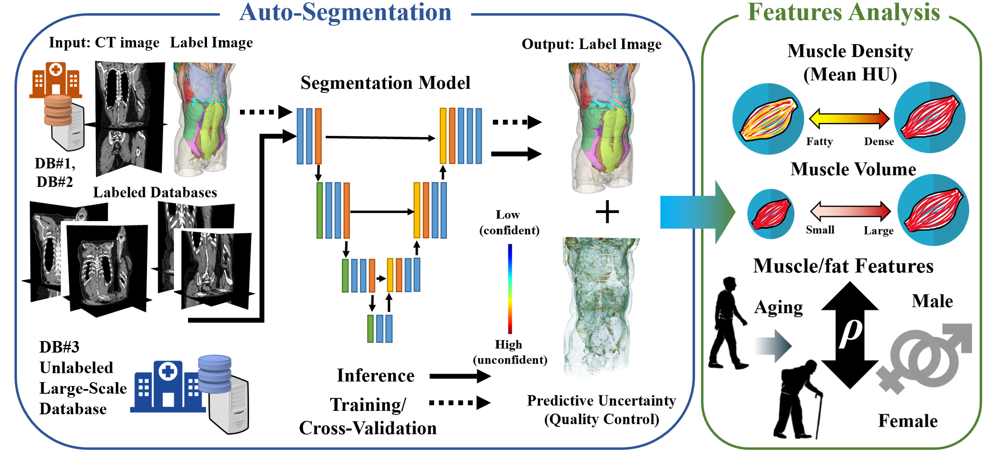

# Torso MSK Segmentation

This repository contains MSKSegmenter codes, including a modified version of the [nnU-Net](https://github.com/MIC-DKFZ/nnUNet) framework, 
specifically tailored for the segmentation of the torso using Musculoskeletal (MSK) datasets.



## Overview
This pipeline allows for high-precision segmentation of anatomical structures within the torso. 
It leverages the robust nnU-Net architecture with custom configurations for MSK imaging.

## Prerequisites
- Ensure you have installed the modified nnU-Net environment.
- **Pretrained Models:** To obtain the pretrained models required for inference, please contact the authors directly.

## Usage

### 1. Training
To train the model on your dataset, follow the standard nnU-Net training protocol 
adjusted for your specific data structure:

```bash
run_training --[training configurations]

```

### 2. Inference

The inference script is designed to handle large volumetric data and provides advanced
outputs for uncertainty estimation and cleaning.

Run the inference using the following command:

```bash
run_inference --indir INPUT_FOLDER --outdir OUTPUT_FOLDER\
--save_probabilities \
--save_entropy \
--postprocess

```

#### Key Flags Explained:

* `--save_probabilities`: Saves the raw softmax probability maps for each class. This is
useful for detailed analysis of the model's confidence across the anatomical structures.
* `--save_entropy`: Computes and saves the Shannon entropy map of the prediction. This
serves as a proxy for **model uncertainty**, helping to identify regions where the
model is less certain about the segmentation.
* `--postprocess`: Automatically applies connected-component analysis to remove
**false positive islands** (small, disconnected components that are likely noise),
ensuring a cleaner and more anatomically plausible final mask.

#### Pretrained models

* This project is a developed in collaboration between Nara Institute of Science and Technology, Shiga University for Medical Science, Ehime University and Osaka University.
To obtain the pretrained model, please contact the corresponding authors of the study.

## License

This project is a derivative of [nnU-Net](https://github.com/MIC-DKFZ/nnUNet) and is
licensed under the [Apache License 2.0](https://www.google.com/search?q=LICENSE).
